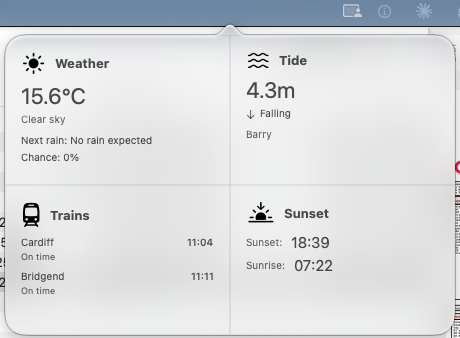
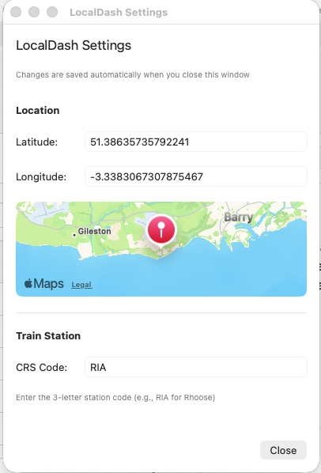

# LocalDash

A macOS menu bar application that displays local information at a glance in a clean, 4-quadrant layout.



### Settings

Right-click the menu bar icon to access settings where you can configure your location and train station.



## Features

### 🌤️ Weather
- Current temperature and conditions
- Weather icons based on current conditions
- Next rain forecast time
- Precipitation probability
- Powered by [Open-Meteo API](https://open-meteo.com)

### 🌊 Tide Information
- Current tide height
- Rising/falling indicator
- Live data from Barry, Wales
- Scraped from [TideTimes.org.uk](https://www.tidetimes.org.uk/barry-tide-times)

### 🚆 Train Departures
- Live departure times from your configured station (default: Rhoose Cardiff Airport)
- Displays next trains in both directions:
  - Eastbound: Cardiff, Caerphilly, Pontypridd, Treherbert
  - Westbound: Bridgend, Swansea
- Shows scheduled time and real-time status (including delay times)
- Powered by [Huxley 2 API](https://huxley2.azurewebsites.net) (National Rail proxy)

### 🌅 Sunrise & Sunset
- Daily sunrise time
- Daily sunset time
- Data scraped from TideTimes.org.uk

## Requirements

- macOS 14.0 or later
- Swift 6.2 or later

## Installation

### Building from Source

1. Clone the repository:
```bash
git clone https://github.com/yourusername/LocalDash.git
cd LocalDash
```

2. Build and run:
```bash
swift build
swift run
```

The app will appear in your menu bar with an info icon (ⓘ). Click it to view the dashboard.

## Usage

Simply click the menu bar icon to open the dashboard popup. The information refreshes automatically when you open the popup.

## Configuration

Right-click the menu bar icon and select "Settings" to configure:
- **Location**: Set your latitude and longitude with a live map preview
- **Train Station**: Enter your local train station's 3-letter CRS code

Settings are automatically saved using UserDefaults and persist between app launches.

## Project Structure

```
LocalDash/
├── Package.swift                 # Swift Package Manager configuration
├── Sources/
│   └── MenuBarInfo/
│       └── MenuBarInfo.swift    # Main application file
└── README.md
```

## Architecture

The app is built using:
- **AppKit**: For menu bar integration (NSStatusItem, NSPopover)
- **SwiftUI**: For the user interface
- **Swift Concurrency**: @MainActor for thread-safe UI updates

### Key Components

- **AppDelegate**: Manages the menu bar item and popover
- **ContentView**: 4-quadrant grid layout
- **WeatherQuadrant & WeatherViewModel**: Weather data fetching and display
- **TideQuadrant & TideViewModel**: Tide information scraping and display
- **TrainQuadrant & TrainViewModel**: Train departure data and display
- **SunQuadrant & SunViewModel**: Sunrise/sunset information

## APIs & Data Sources

| Feature | Source | Type |
|---------|--------|------|
| Weather | Open-Meteo | REST API (free, no key required) |
| Tides | TideTimes.org.uk | Web scraping |
| Trains | Huxley 2 | REST API (free National Rail proxy) |
| Sun Times | TideTimes.org.uk | Web scraping |

## Future Enhancements

- [x] User-configurable location via preferences
- [x] Support for multiple train stations
- [ ] Auto-refresh at configurable intervals
- [ ] Dark mode support
- [ ] Custom icon designs
- [ ] Export as standalone .app bundle

## License

MIT License - feel free to use and modify as needed.

## Contributing

Contributions are welcome! Please feel free to submit a Pull Request.

## Acknowledgments

- Weather data from [Open-Meteo](https://open-meteo.com)
- Train data from [Huxley 2](https://huxley2.azurewebsites.net)
- Tide and sun data from [TideTimes.org.uk](https://www.tidetimes.org.uk)
